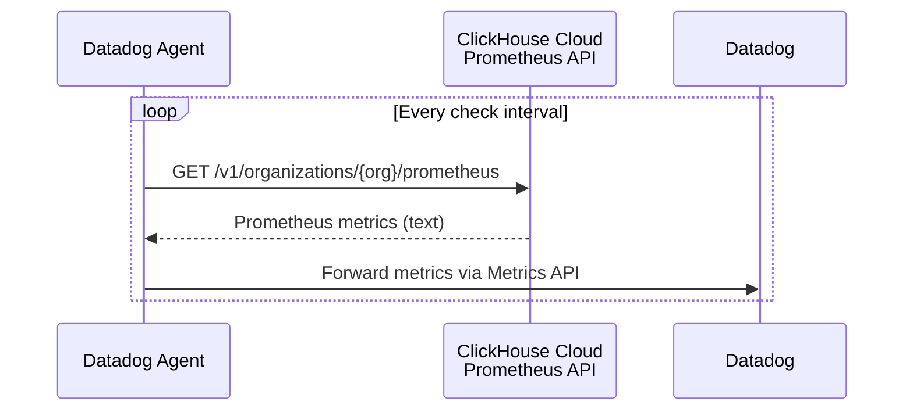
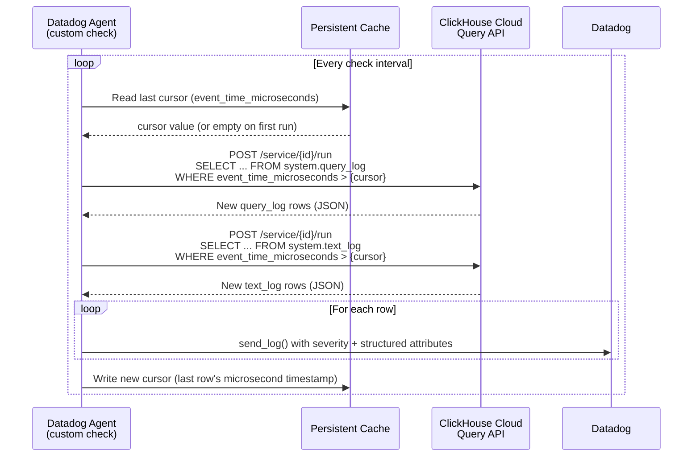

# ClickHouse Cloud + Datadog

Datadog's official ClickHouse integration does not work with ClickHouse Cloud. This repo fills that gap -- metrics and logs from ClickHouse Cloud into Datadog, installable in under 10 minutes.

## What You Get

**Metrics** -- all ClickHouse server metrics (queries, connections, memory, merges, storage, throughput) via the built-in Datadog OpenMetrics check. No custom code, just a config file pointing at the ClickHouse Cloud Prometheus API.

**Logs** -- query logs from `system.query_log` and server error/warning logs from `system.text_log`, shipped to Datadog Logs via a custom Python check. Includes automatic severity mapping:

| Source | Level | Condition |
|--------|-------|-----------|
| query_log | `info` | Normal completed query |
| query_log | `warning` | Duration exceeds slow query threshold |
| query_log | `error` | Query failed with exception |
| text_log | `warning` / `error` / `critical` | Mapped from ClickHouse Warning / Error / Fatal |

Each query log entry carries structured attributes: `query_id`, `user`, `duration_ms`, `memory_bytes`, `read_rows`, `read_bytes`, `exception`, `tables`, and more -- all searchable and facet-able in Datadog Log Explorer.

## Prerequisites

- Linux VM with [Datadog Agent](https://docs.datadoghq.com/agent/) (v7+) installed
- ClickHouse Cloud service with a [Cloud API key](https://clickhouse.com/docs/en/cloud/manage/openapi) (key ID + secret)
- Your ClickHouse Cloud **service UUID** (from the console URL)
- Your ClickHouse Cloud **organization ID** (for metrics endpoint)

## Setup

### 1. Copy files to the Datadog Agent

```bash
# Custom check
sudo cp checks/clickhouse_cloud.py /etc/datadog-agent/checks.d/clickhouse_cloud.py

# Log check config
sudo mkdir -p /etc/datadog-agent/conf.d/clickhouse_cloud.d
sudo cp conf.d/clickhouse_cloud.d/conf.yaml.example \
  /etc/datadog-agent/conf.d/clickhouse_cloud.d/conf.yaml

# Metrics config (OpenMetrics)
sudo mkdir -p /etc/datadog-agent/conf.d/openmetrics.d
sudo cp conf.d/openmetrics.d/conf.yaml.example \
  /etc/datadog-agent/conf.d/openmetrics.d/conf.yaml
```

### 2. Set file permissions

```bash
sudo chown dd-agent:dd-agent /etc/datadog-agent/checks.d/clickhouse_cloud.py
sudo chown dd-agent:dd-agent /etc/datadog-agent/conf.d/clickhouse_cloud.d/conf.yaml
sudo chown dd-agent:dd-agent /etc/datadog-agent/conf.d/openmetrics.d/conf.yaml

sudo chmod 644 /etc/datadog-agent/checks.d/clickhouse_cloud.py
sudo chmod 640 /etc/datadog-agent/conf.d/clickhouse_cloud.d/conf.yaml
sudo chmod 640 /etc/datadog-agent/conf.d/openmetrics.d/conf.yaml
```

### 3. Configure the log check

Edit `/etc/datadog-agent/conf.d/clickhouse_cloud.d/conf.yaml`:

```yaml
init_config:

instances:
  - service_id: "<your-service-uuid>"
    key_id: "<your-api-key-id>"
    key_secret: "<your-api-key-secret>"

    collect_query_logs: true
    collect_text_logs: true

    tags:
      - "env:production"
      - "clickhouse_cluster:<your-cluster-name>"
```

All three credential fields are required. Everything else has sensible defaults.

#### Optional tuning parameters

| Parameter | Default | Range | Description |
|-----------|---------|-------|-------------|
| `log_batch_size` | 1000 | 1 -- 10000 | Max rows fetched per check run |
| `slow_query_threshold_ms` | 5000 | 0 -- 3600000 | Queries slower than this are logged as `warning` |
| `initial_backfill_minutes` | 60 | 1 -- 1440 | How far back to look on first run (avoids flooding Datadog with history) |
| `query_timeout_seconds` | 30 | 5 -- 300 | HTTP timeout for each ClickHouse Cloud API call |

### 4. Configure metrics

Edit `/etc/datadog-agent/conf.d/openmetrics.d/conf.yaml`:

```yaml
instances:
  - openmetrics_endpoint: "https://api.clickhouse.cloud/v1/organizations/<your-org-id>/prometheus?filtered_metrics=true"
    namespace: "clickhouse"
    username: "<your-key-id>"
    password: "<your-key-secret>"
    tls_verify: true
    honor_labels: true
    metrics:
      - "^ClickHouse.*"
    tags:
      - "env:production"
      - "clickhouse_cluster:<your-cluster-name>"
```

The default `"^ClickHouse.*"` collects all exposed metrics. To reduce volume, replace it with a specific allowlist (commented examples are in the template).

### 5. Enable logs and restart

```bash
# Enable log collection in the main Datadog config (if not already enabled)
sudo sed -i 's/# logs_enabled: false/logs_enabled: true/' /etc/datadog-agent/datadog.yaml

sudo systemctl restart datadog-agent
```

### 6. Verify

```bash
# Dry-run the custom check
sudo datadog-agent check clickhouse_cloud

# Check overall agent status
sudo datadog-agent status
```

Look for `clickhouse_cloud` in the Checks section and `openmetrics` with your ClickHouse endpoint in the output.

## How It Works

### Metrics flow

The Datadog Agent's built-in OpenMetrics check scrapes the ClickHouse Cloud Prometheus API on each interval. No custom code -- config only.



### Logs flow

The custom Python check polls ClickHouse Cloud system tables via the Query API, tracks its position with a microsecond-precision cursor, and ships new rows to Datadog Logs.



### Key design decisions

- **At-least-once delivery** -- the cursor advances only after logs are emitted. Duplicate delivery is preferred over log loss.
- **Automatic retries** -- transient HTTP errors (502/503/504) are retried twice with exponential backoff before reporting failure.
- **No extra dependencies** -- uses only `requests` and `urllib3`, both bundled with the Datadog Agent.

## Troubleshooting

**No logs appearing in Datadog**
1. Run `sudo datadog-agent check clickhouse_cloud` -- look for errors in the output.
2. Confirm `logs_enabled: true` in `/etc/datadog-agent/datadog.yaml`.
3. Verify your API key has access to the Cloud Query API.

**No metrics appearing**
1. Run `sudo datadog-agent status` and look for the `openmetrics` check.
2. Verify the Prometheus endpoint URL, org ID, and credentials.
3. Try curling the endpoint directly: `curl -u '<key_id>:<key_secret>' 'https://api.clickhouse.cloud/v1/organizations/<org-id>/prometheus?filtered_metrics=true'`

**Service check reporting CRITICAL**
- The check cannot reach the ClickHouse Cloud Query API. Check network/firewall rules, DNS resolution, and credential validity.

**Duplicate logs after agent restart**
- Expected in rare cases. The cursor is persisted to disk, but if the agent crashes between emitting logs and writing the cursor, a small overlap is possible. This is by design.

**Reset cursors to re-collect historical data**
```bash
sudo systemctl stop datadog-agent
sudo rm -f /opt/datadog-agent/run/clickhouse_cloud*
sudo systemctl start datadog-agent
```

## License

[MIT](LICENSE)
